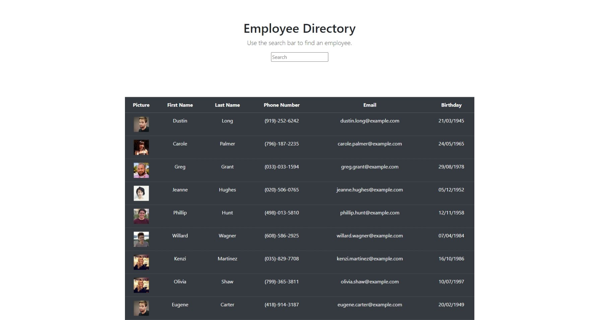

# Employee Directory

## Usage
* For this application you are able to view your employee directory and search for an employee or employees.

## installation
* to run this app, open terminal and run npm start in the command line.

